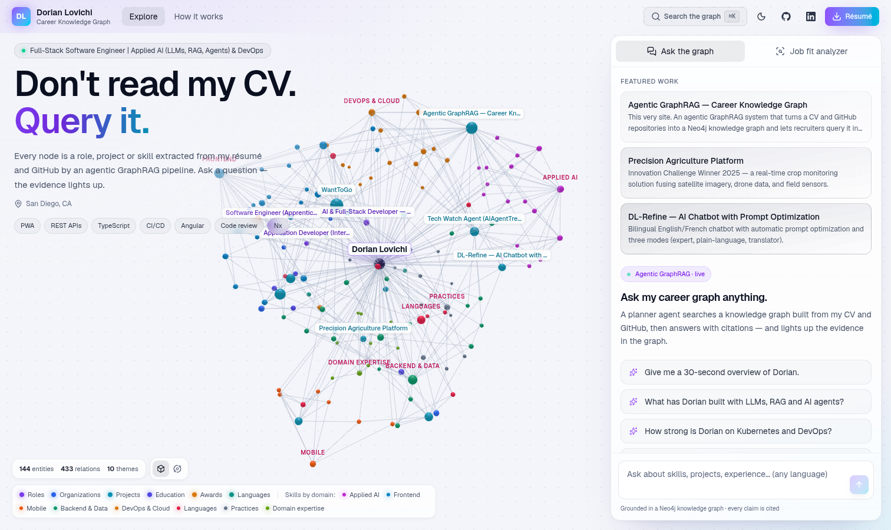
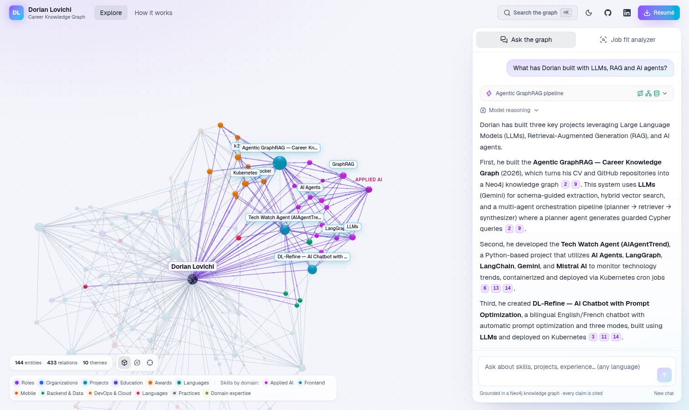
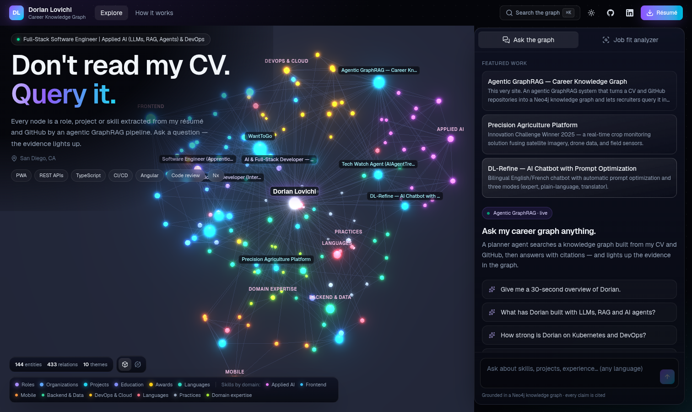
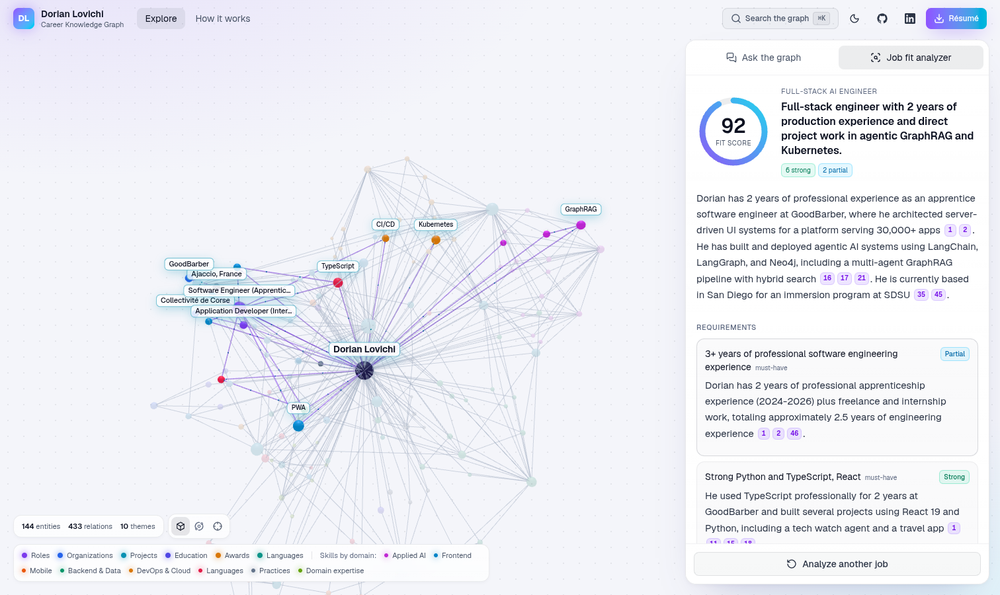
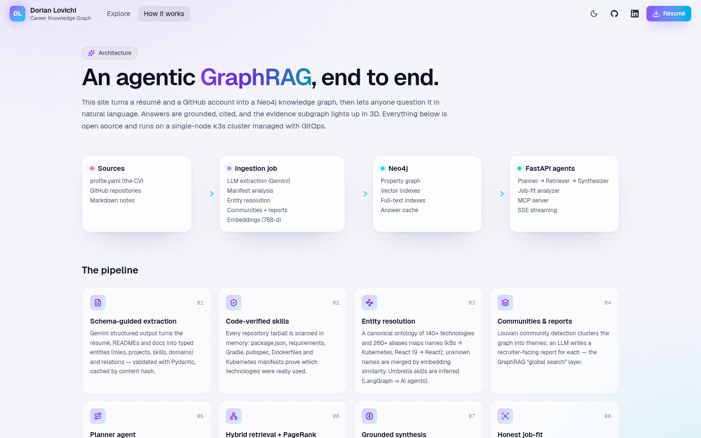
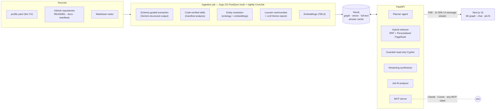
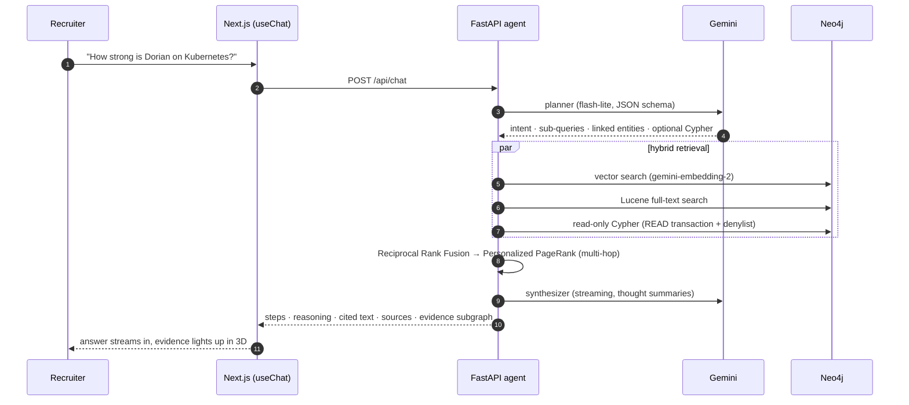

<div align="center">

# Don't read my CV. Query it.

**An agentic GraphRAG over Dorian Lovichi's résumé and GitHub** — ask anything in plain English (or French),
get a grounded, cited answer, and watch the evidence light up in a 3D knowledge graph.

[**graphrag.dorianlovichi.com**](https://graphrag.dorianlovichi.com) ·
[How it works](https://graphrag.dorianlovichi.com/how-it-works) ·
[Résumé (PDF)](apps/web/public/dorian-lovichi-resume.pdf)

[](https://github.com/LovichiDorian/GraphRag/actions/workflows/ci.yml)
[](https://github.com/LovichiDorian/GraphRag/actions/workflows/release.yml)
[](LICENSE)



</div>

## What it does

- **Ask the graph.** A planner agent decomposes the question, a hybrid retriever (vector + full-text +
  Personalized PageRank) gathers multi-hop evidence from Neo4j, and a streaming synthesizer answers with
  inline citations. Every step — plan, retrieval, Cypher, model reasoning — is visible in the UI.
- **See the evidence.** The subgraph behind each answer is highlighted in an interactive 3D graph
  (WebGL + bloom in dark mode, a 2D canvas on phones), and hovering a citation shows the source passage.
- **Job-fit analyzer.** Paste a job description: requirements are extracted, each gets its own evidence
  retrieval, an LLM grades them (strong / partial / transferable / gap) and the score is computed
  deterministically — gaps included, with interview questions.
- **Plug it into your own assistant.** A public [MCP](https://modelcontextprotocol.io) server exposes
  `ask`, `search_graph`, `get_entity`, `find_connection`, `assess_job_fit` and `get_profile`.
- **Always honest.** Skills are weighted by evidence (professional use > shipped projects > listed on the
  CV) and verified against real code: dependency manifests, Dockerfiles and Kubernetes manifests in the
  repositories.

| Light (default) | Dark |
| --- | --- |
|  |  |
|  |  |

## Architecture



### How a question is answered



**Built for a free tier that fails.** Gemini's free tier allows a handful of requests per minute and per
day, and models regularly return 503 under load. Every call goes through model fallback chains with
circuit breakers that honour `retryDelay`; a stream that dies mid-answer is continued seamlessly by the
next model; answers are cached in Neo4j per graph version (starter questions are pre-computed); SSE
heartbeats keep proxies from cutting slow streams; and when every model is down the agent still returns
an extractive, cited answer from the graph.

## Stack

| Layer | Technologies |
| --- | --- |
| AI | Gemini 3.x flash / flash-lite (structured output, thinking), `gemini-embedding-2`, MCP 2 |
| Graph | Neo4j 2026 (vector + full-text indexes, Cypher), Personalized PageRank (NumPy), Louvain (NetworkX) |
| Backend | Python 3.14, FastAPI, async Neo4j driver, Pydantic 2, uv, structlog, Prometheus metrics |
| Frontend | Next.js 16, React 19, Tailwind CSS 4, Vercel AI SDK 7, three.js (react-force-graph), Motion, Radix, cmdk |
| Platform | k3s, Argo CD (GitOps), Traefik, cert-manager, NetworkPolicies, CronJobs |
| Supply chain | GitHub Actions, native amd64 + arm64 builds, SBOM + provenance, cosign keyless signing, Trivy, Dependabot |

## Repository layout

```text
apps/api/          FastAPI service + ingestion pipeline (package `careergraph`)
  src/careergraph/
    agent/         planner → retriever → synthesizer orchestration, UI-stream encoder, answer cache
    retrieval/     hybrid search (RRF) + Personalized PageRank
    graph/         schema, Neo4j store, in-memory snapshot
    ingest/        sources (CV, GitHub), extraction, tech ontology, entity resolution, communities
    fit/           job-fit analyzer
    llm/           Gemini client: fallback chains, circuit breakers, quotas
    mcp_server.py  Model Context Protocol tools
apps/web/          Next.js app (3D/2D graph, chat, job fit, light/dark themes)
data/              profile.yaml (the curated CV) + notes — the sources of truth
deploy/k8s/        Kustomize base + prod overlay
deploy/argocd/     Argo CD Application
deploy/scripts/    idempotent k3s installer
.github/workflows/ CI, multi-arch release + GitOps bump, one-click bootstrap
```

## Run it locally

Requirements: Docker, and a free [Google AI Studio](https://aistudio.google.com/apikey) key.

```bash
cp .env.example .env            # then set GEMINI_API_KEY
docker compose up --build       # Neo4j + API + one-shot ingestion + web → http://localhost:3000
```

For development with hot reload (needs [uv](https://docs.astral.sh/uv/) and pnpm):

```bash
make install     # uv sync + pnpm install
make neo4j       # Neo4j in Docker
make ingest      # build the knowledge graph
make api         # FastAPI on :8000
make web         # Next.js on :3000 (proxies /api and /mcp to :8000)
make check       # ruff, mypy, pytest, biome, tsc — same as CI
```

The ingestion is incremental and cache-friendly: LLM extractions and embeddings are cached by content
hash, so a re-run only pays for what changed. `careergraph-ingest --dry-run` builds the graph without
writing it, `--no-llm` skips extraction entirely.

## Deploy on k3s

The production setup is a single-node k3s cluster managed with GitOps:

1. **DNS** — an `A` record for the domain pointing to the server.
2. **Bootstrap once** on the server (idempotent: installs k3s, cert-manager and Argo CD only if missing,
   creates the namespace and secrets, registers the Argo CD application):

   ```bash
   curl -sfL https://raw.githubusercontent.com/LovichiDorian/GraphRag/main/deploy/scripts/install.sh \
     | sudo GEMINI_API_KEY=xxxx bash
   ```

   …or run the **Bootstrap cluster** workflow from the Actions tab (secrets `SSH_PRIVATE_KEY` and
   `GEMINI_API_KEY`, optional variables `SSH_HOST` / `SSH_USER`). `--local-build` builds the images on
   the server instead of pulling them from GHCR.
3. **Ship** — every push to `main` runs CI, builds signed multi-arch images, commits the new tags to
   `deploy/k8s/overlays/prod`, and Argo CD rolls the deployments and re-runs the ingestion job.
   A nightly CronJob picks up new GitHub activity.

Hardening: non-root containers with read-only root filesystems and dropped capabilities, default-deny
NetworkPolicies (only the API and the ingestion job can reach Neo4j), Traefik rate limiting and security
headers, `/metrics` and probes not exposed publicly, TLS from Let's Encrypt.

## Configuration

Environment variables of the API and ingestion job (see [`settings.py`](apps/api/src/careergraph/settings.py)):

| Variable | Default | Purpose |
| --- | --- | --- |
| `GEMINI_API_KEY` | — | Google AI Studio key (required for answers and extraction) |
| `NEO4J_URI` / `NEO4J_PASSWORD` | `bolt://localhost:7687` / `localdevpassword` | Graph database |
| `CHAT_MODELS`, `FAST_MODELS`, `EXTRACTION_MODELS` | Gemini 3.x chains | Comma-separated fallback chains |
| `EMBEDDING_MODEL` | `gemini-embedding-2` | Embeddings (768 dimensions) |
| `GITHUB_TOKEN` | — | Optional, raises GitHub API limits during ingestion |
| `GITHUB_REPOS_EXCLUDE` | — | Repositories to leave out of the graph |
| `RATE_LIMIT_PER_MINUTE` / `RATE_LIMIT_PER_DAY` | `8` / `80` | Per-visitor limits (a job-fit analysis costs 3) |
| `LLM_DAILY_BUDGET` | `3000` | Global guard on model calls per day |
| `ANSWER_CACHE_TTL_S` | `86400` | Lifetime of cached answers |
| `WARM_CACHE` | `true` | Pre-compute answers to the starter questions |

## Use it from your AI assistant

```bash
claude mcp add --transport http dorian https://graphrag.dorianlovichi.com/mcp
```

```json
{ "mcpServers": { "dorian-career-graph": { "type": "http", "url": "https://graphrag.dorianlovichi.com/mcp" } } }
```

## License

[MIT](LICENSE) © Dorian Lovichi
